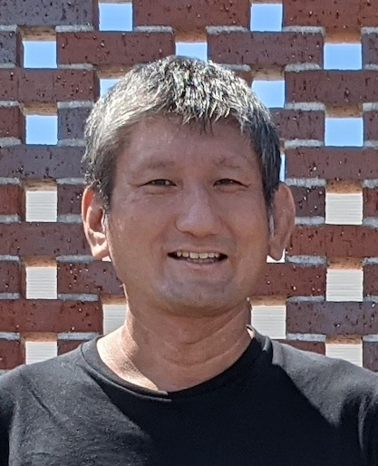

+++
title = '経験の共有で選択力を'
date = 2024-05-22T09:24:25+09:00
draft = false
+++

Vision
## 経験共有による選択力の向上
知ってさえいれば、と思ったことはないでしょうか？  
あることを知って日々の生活の質が上がったり、知らないことで取り返しのつかないことを経験している人もいると思います。せっかくしたその経験は活かされているでしょうか？  私たちは経験を共有し、人々の選択力向上に役立てます。

---
Mission
## 経験収集と状況適合分析
ある人の経験はそのままでは役に立ちません。
それはその人とあなたとでは立場や状況が異なるからです。情報技術や人工知能などを用いてある人の経験情報を分析し、あなたの立場や状況に適合するようにカスタマイズして提供します。  
そのために経験情報を収集し続けます。

---
Crue
## 代表
  
丸山 毅  
1978年生まれ  
アトピー標準治療の副作用で灰色の青春  
Senior Software Developer  
慶應義塾大学卒業  

---
Company
## 会社概要
| | |
|:-------|:-------------|
| **会社名**  | 合同会社Sotai |
| **代表**    | 丸山 毅 |
| **事業内容**  | ソフトウェア開発・提供 |
| **所在地**  | 埼玉県上尾市 |
| **設立**    | 2013年9月10日 |